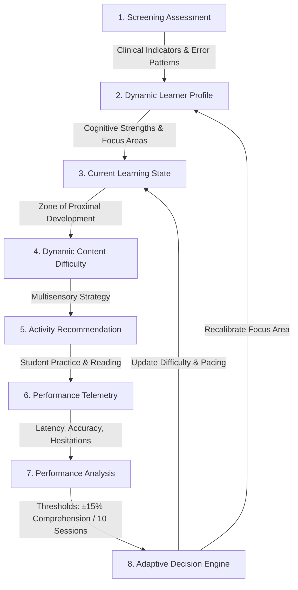

# DyslexAid V2 Target Architecture

**Platform Vision:** Adaptive, Personalized, and Assistive Intelligence Platform for Neurodivergent Learners  
**Evolution Stage:** V2 Foundation Architecture  
**Compatibility Mode:** 100% Backward Compatible with V1

---

## 1. Architectural Principles

1. **Continuous Adaptive Learning Loop:** Learning is non-linear; the platform dynamically adapts difficulty, content pacing, and visual ergonomics based on ongoing student responses and micro-feedback.
2. **Non-Clinical, Strengths-Based Framing:** The intelligence layer delivers educational screening indicators, cognitive strengths, and customized learning accommodations without making clinical or medical diagnoses.
3. **Resilient Dual-Mode Execution:** Full online AI-native intelligence (Google Gemini Flash & Claude) seamlessly degrading to deterministic, offline-capable rule-based heuristics and local ML models when offline.
4. **Zero-Regressions Guarantee:** All existing V1 REST endpoints, user accounts, and classroom ERP workflows remain completely intact and active.

---

## 2. High-Level System Architecture

```
┌────────────────────────────────────────────────────────────────────────────────────────┐
│                                   CLIENT TIER (React 18)                               │
├──────────────────────────┬─────────────────────────────┬───────────────────────────────┤
│    Student Experience    │      Teacher Experience     │       Parent Experience       │
│  • Dashboard / Home      │  • Classroom Dashboard      │  • Progress Insights          │
│  • Adaptive Learning     │  • Student Roster & Drilldown│  • Home Reading Activities   │
│  • Reading Coach         │  • Diagnostic Analytics     │  • Daily Goal Tracker         │
│  • Personal AI Tutor     │  • Intervention Manager     │  • Parent Observations        │
│  • Progress & Badges     │  • Lesson Plan Generator    │                               │
│  • Accessibility Profile │  • Assignment & Grading ERP │                               │
└──────────────────────────┴──────────────┬──────────────┴───────────────────────────────┘
                                          │ HTTP / WebSockets / SSE
                                          ▼
┌────────────────────────────────────────────────────────────────────────────────────────┐
│                                  BACKEND TIER (FastAPI)                                │
├────────────────────────────────────────────────────────────────────────────────────────┤
│  Core API & Auth Layer       │  Learner Intelligence Layer   │  Assistance & Media     │
│  • JWT Authentication        │  • Screening & Assessment     │  • Tesseract OCR Engine │
│  • RBAC (Student/Teacher/Par)│  • Learner Profile Service    │  • Text Simplifier      │
│  • Feature Flag Manager      │  • Adaptive Engine            │  • Speech Analysis & TTS│
│  • Classroom & Assignments   │  • Content Difficulty Engine  │  • Multi-Turn AI Tutor  │
│  • Notifications (SSE)       │  • Activity Recommender       │  • Reading Coach        │
└──────────────────────────┬───┴──────────┬────────────────────┴───┬─────────────────────┘
                           │              │                        │
                           ▼              ▼                        ▼
┌───────────────────────────────────┐ ┌──────────────────────┐ ┌─────────────────────────┐
│     Persistence Layer (MongoDB)   │ │  Offline ML Engine   │ │ Cloud Generative AI     │
│  • users & learner_profiles       │ │  • Scikit-Learn (PKL)│ │ • Google Gemini 2.0/3.5 │
│  • screening_results & states     │ │  • Joblib inference │ │ • Anthropic Claude 3.5  │
│  • activities & attempts          │ │  • Synthetic models  │ │ • Offline Rules Engine  │
│  • reading_sessions & analytics   │ └──────────────────────┘ └─────────────────────────┘
└───────────────────────────────────┘
```

---

## 3. The Continuous Adaptive Learning Loop

The core intelligence mechanism of DyslexAid V2 is organized as a closed-loop feedback system:



### Loop Stages Explained:
1. **Screening Assessment:** Gathers multidimensional evidence across 12 cognitive domains (DST/PhAB-aligned).
2. **Learner Profile:** Maintains normalized domain scores, subtype likelihoods, cognitive strengths, and accessibility preferences.
3. **Learning State:** Represents real-time readiness: streak, active module, fatigue metrics, mastered words, and active difficulty tier.
4. **Content Difficulty:** Determines sentence lengths, syllable complexity, vocabulary thresholds, and visual scaffolding.
5. **Activity Recommendation:** Selects targeted micro-activities (phoneme blending, RAN speed naming, sight-word drills, reading comprehension).
6. **Student Performance:** Captures fine-grained interaction telemetry: completion time, answer correctness, hesitation rate, and hint usage.
7. **Performance Analysis:** Computes rolling mastery, retention stability, and error categorization.
8. **Adaptive Decision:** Automatically recalibrates task difficulty, adjusts learning plans, and notifies teachers of breakthrough progress or intervention needs.

---

## 4. Frontend Component Architecture

```
frontend/src/
├── features/
│   ├── learner/             # V2 Learner Profile state, cognitive radars, strengths
│   ├── learning/            # Adaptive activity engine, daily task player
│   ├── reading/             # Interactive Reading Coach, word highlighting, TTS
│   ├── tutor/               # Assistive conversational tutor with conversational scaffolding
│   ├── progress/            # Growth analytics, mastery curves, domain radars
│   ├── teacher/             # Classroom intervention dashboard, student cohort trends
│   ├── parent/              # Parent/Guardian portal, home progress summaries
│   └── gamification/        # Badges, streaks, achievement celebrations
├── components/
│   ├── v2/                  # Reusable V2 UI components (RadarCharts, VisualSliders)
│   ├── shared/              # Common navigation, headers, footers
│   └── ui/                  # Accessible buttons, modals, cards, badges
├── hooks/
│   ├── v2/                  # useLearnerProfile, useAdaptiveEngine, useReadingCoach
│   └── ...                  # useSession, useTTS
├── api/
│   ├── v2/                  # V2 API clients (learner, learning, reading, analytics)
│   └── client.js            # Existing V1 Axios client (preserved)
└── pages/                   # Top-level page routes (StudentHome, TeacherHome, etc.)
```

---

## 5. Backend Service Architecture

```
backend/
├── core/
│   ├── config.py            # Centralized settings, versioning, feature flags
│   └── security.py          # JWT, password encryption, role verification
├── models/
│   ├── v2_learner_profile.py# Pydantic v2 schemas for Learner Profiles
│   └── v2_learning_state.py # Schemas for Learning States and Activities
├── services/
│   ├── ai/
│   │   ├── ai_service.py    # Primary Gemini/Claude gateway (extended from V1)
│   │   ├── tutor_service.py # Socratic tutoring and error remediation prompts
│   │   └── prompt_manager.py# Centralized, versioned prompt templates
│   ├── learning/
│   │   ├── learner_profile_service.py # Profile computation & synchronization
│   │   ├── adaptive_engine.py         # Progression & difficulty adjustment
│   │   ├── difficulty_engine.py       # Text readability & complexity scoring
│   │   └── activity_recommender.py    # Activity matching algorithm
│   ├── reading/
│   │   ├── reading_coach.py           # Interactive guided reading session coordinator
│   │   ├── reading_analyzer.py        # Reading speed, hesitation, and error analyzer
│   │   └── ocr_service.py             # Tesseract OCR service (from V1)
│   ├── analytics/
│   │   ├── student_analytics.py       # Individual student growth & mastery modeling
│   │   └── teacher_analytics.py       # Cohort and classroom intervention metrics
│   ├── personalization/
│   │   └── personalization.py         # Accommodation engine (from V1)
│   └── screening/
│       └── screening_analyzer.py      # Standardized 12-domain analyzer (from V1)
└── routers/
    ├── v2_learner.py        # /api/v2/learner/... endpoints
    ├── version.py           # /api/version metadata endpoint
    └── [existing v1 routers]# auth, classroom, assignments, scan, simplify, etc.
```

---

## 6. Security, Isolation, and Role Hierarchy

1. **Role Separation:**
   - `student`: Can read and update only their own profile, learning state, and assignment submissions.
   - `teacher`: Can read students enrolled in their assigned classrooms, grade assignments, generate lesson plans, and add teacher notes.
   - `parent` (V2 target): Can view only students explicitly linked via secure parental invite codes.
2. **Stateless JWT Tokens:**
   - Tokens contain signed claims (`sub` = user UUID).
   - In V2, role validation is enforced per-endpoint via FastAPI dependency injection (`require_student`, `require_teacher`, `require_parent`).
3. **Data Protection:**
   - Passwords hashed using standard `bcrypt`.
   - Live environment secrets (`GEMINI_API_KEY`, `MONGO_URL`, `JWT_SECRET`) strictly isolated from version control.
