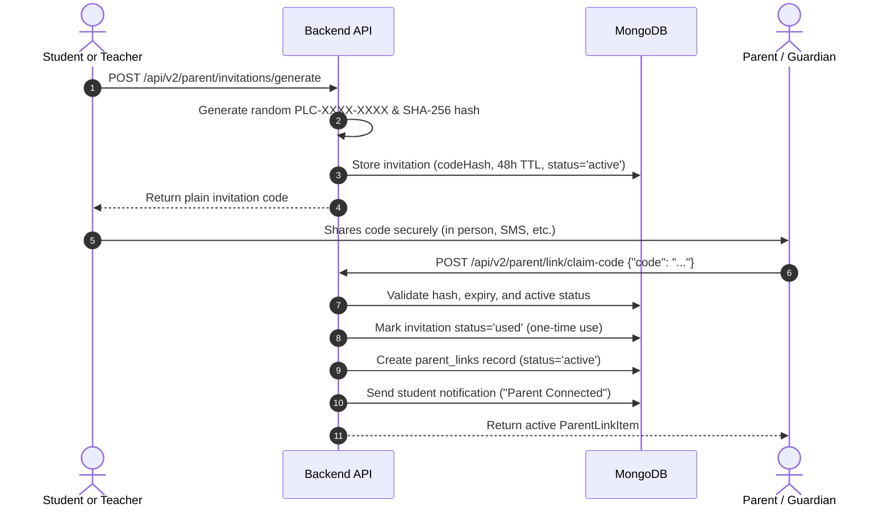

# DyslexAid V2 — Phase 11: Parent & Guardian Portal Architecture & Documentation

## 1. Overview & Pedagogical Philosophy

The DyslexAid V2 Parent & Guardian Portal provides families with a clear, supportive, and jargon-free window into their child's reading practice journey.

### Core Pedagogical & Privacy Principles:
1. **Effort & Consistency Over High-Stakes Evaluation**:
   - The portal focuses on celebrating daily practice persistence, reading time invested, stories completed, and earned milestones.
   - It avoids competitive metrics, class rankings, and public leaderboards.
2. **Descriptive Educational Observations, Not Clinical Diagnoses**:
   - All summaries and progress indicators are explicitly labeled as descriptive educational practice metrics.
   - The portal does not claim that an intervention cured reading difficulties, nor does it deliver medical or neurological labels.
3. **Strict Child Privacy & Content Shielding**:
   - Private 1-on-1 conversations with the Personal AI Tutor are strictly shielded from parents to preserve a safe, uninhibited learning environment.
   - Raw speech audio recordings, detailed phonetic error breakdowns, and teacher-only internal notes are never exposed.
4. **Verified, Bidirectional Relationship Control**:
   - Access requires a verified link established through either a one-time invitation code or an explicit approval by the learner/teacher.
   - Either the parent or the learner can revoke the connection at any time with immediate effect.

---

## 2. Parent & Guardian Identity & Access Control

### Role Architecture
The system integrates the `parent` role into the existing authentication framework (`backend/routers/auth.py`, `backend/deps/deps.py`):
- **User Roles Supported**: `student`, `teacher`, `parent`.
- **Authentication**: JWT token authentication via `Authorization: Bearer <token>` on all requests.
- **Backend Guard**: `require_parent` dependency ensures only users with `role: "parent"` can invoke parent dashboard endpoints. Non-parents receive `403 Forbidden` (`detail="Parent role required"`).
- **Endpoint Tenant Boundary**: Supplying a `studentId` never grants access unless an `active` relationship record is verified in `parent_links`.

---

## 3. Secure Parent–Student Linking Workflows

DyslexAid provides two verified linking pathways:

### Pathway A: One-Time Cryptographic Invitation Code (Recommended)


### Pathway B: Direct Link Request with Approval
1. **Initiate Request**: Parent calls `POST /api/v2/parent/link/request` with student email or student ID.
2. **Pending State**: A relationship record is created in `parent_links` with `status: "pending"`.
3. **Notification**: A notification is delivered to the student's dashboard.
4. **Approval / Rejection**:
   - Student calls `POST /api/v2/parent/student/requests/{id}/approve` $\to$ transitions to `active`.
   - Student calls `POST /api/v2/parent/student/requests/{id}/reject` $\to$ transitions to `rejected`.
5. **No Data Leakage**: Until approved, the parent cannot access any learning data for that student.

### Instant Revocation
Either party can immediately terminate access:
- **Parent Revocation**: `POST /api/v2/parent/links/{link_id}/revoke`
- **Student Revocation**: `POST /api/v2/parent/student/links/{link_id}/revoke`
- Status transitions immediately to `revoked`. Subsequent requests to dashboard endpoints return `403 Forbidden` instantly.
- Historical student learning records remain completely intact and unmodified.

---

## 4. Backend Data Models & Collections

### 1. `parent_links` Collection
Stores relationship records between parents and learners:
```json
{
  "id": "uuid-v4",
  "parentId": "user-parent-id",
  "parentName": "Sarah Jenkins",
  "parentEmail": "sarah.parent@example.com",
  "studentId": "user-student-id",
  "studentName": "Leo Jenkins",
  "relationship": "parent",
  "status": "active",
  "verifiedAt": 1727913600,
  "verifiedBy": "invitation_code",
  "invitationId": "inv-uuid",
  "requestedAt": 1727913600,
  "createdAt": 1727913600,
  "revokedAt": null,
  "revokedBy": null
}
```
**Database Indexes**:
- Compound index: `("parentId", "studentId", "status")`
- Compound index: `("studentId", "status")`
- Index: `("parentId", "status")`

### 2. `parent_invitations` Collection
Stores short-lived one-time invitation hashes:
```json
{
  "id": "uuid-v4",
  "codeHash": "sha256-hex-digest",
  "studentId": "user-student-id",
  "studentName": "Leo Jenkins",
  "createdBy": "user-id",
  "creatorRole": "student",
  "expiresAt": 1728086400,
  "status": "active",
  "createdAt": 1727913600,
  "usedAt": null,
  "usedByParentId": null
}
```
**Database Indexes**:
- Index: `("codeHash")`
- Index: `("studentId", "status")`
- Index: `("expiresAt")`

---

## 5. Parent Portal API Endpoints

All endpoints are registered under `/api/v2/parent` in `backend/routers/v2_parent.py`:

| Method | Endpoint | Description | Role Required |
| :--- | :--- | :--- | :---: |
| `GET` | `/api/v2/parent/profile` | Parent user summary & linked counts | `parent` |
| `GET` | `/api/v2/parent/learners` | List all linked learners (active & pending) | `parent` |
| `POST` | `/api/v2/parent/link/claim-code` | Claim 48h invitation code | `parent` |
| `POST` | `/api/v2/parent/link/request` | Submit link request by student email/ID | `parent` |
| `POST` | `/api/v2/parent/links/{id}/revoke` | Revoke active connection | `parent` or `student` |
| `GET` | `/api/v2/parent/dashboard` | Dashboard metrics for default/selected child | `parent` |
| `GET` | `/api/v2/parent/learners/{id}/dashboard` | Dashboard metrics for specific authorized child | `parent` |
| `GET` | `/api/v2/parent/learners/{id}/activity` | Bounded chronological activity timeline | `parent` |
| `POST` | `/api/v2/parent/invitations/generate` | Generate 48h one-time invitation code | `student` or `teacher` |
| `GET` | `/api/v2/parent/student/requests` | List incoming link requests | `student` |
| `POST` | `/api/v2/parent/student/requests/{id}/approve` | Approve incoming link request | `student` or `teacher` |
| `POST` | `/api/v2/parent/student/requests/{id}/reject` | Reject incoming link request | `student` or `teacher` |
| `GET` | `/api/v2/parent/student/links` | List active parent connections | `student` |
| `POST` | `/api/v2/parent/student/links/{id}/revoke` | Revoke active parent connection | `student` |

---

## 6. Dashboard Metrics & Data Sources

The dashboard aggregates data strictly from existing Phase 2–10 collections:

| Metric Card | Source Collection | Description |
| :--- | :--- | :--- |
| **Stories Read & Minutes** | `db.reading_sessions` | Total completed reading sessions and aggregate reading minutes. |
| **Average Comprehension** | `db.reading_sessions` | Average score across multiple-choice comprehension questions. |
| **Reading Difficulty Level** | `db.learning_states` | Current calibrated adaptive level (Tier 1, Tier 2, etc.). |
| **Practice Streak** | `db.gamification_summaries` | Current active calendar days streak and historical personal best. |
| **Learning Points** | `db.gamification_summaries` | Server-awarded points for effort and activity completion. |
| **Milestones & Badges** | `db.gamification_summaries` | Badges earned (e.g. "First Steps", "Reading Explorer"). |
| **Recent Reading History** | `db.reading_sessions` | List of 5 recent stories read (title, tier, words, comprehension). |
| **Adaptive Tasks** | `db.activity_attempts` | List of 5 recent skill challenges (phonics, rhyming, memory). |
| **Progress Trends** | Multi-domain aggregation | Longitudinal trend direction (`improving`, `stable`, `insufficient_data`). |

---

## 7. Supportive Home Practice Activities

The service provides encouraging, non-clinical activity suggestions curated for families:
1. **10-Minute Shared Reading**: Alternating reading sentences or paragraphs aloud together to build natural rhythm and confidence.
2. **Celebrate Consistency & Effort**: Praising persistence on tricky words rather than speed or errorless perfection.
3. **Quiet & Comfortable Reading Nook**: Creating a calming, cozy reading corner free from TV or loud distractions.
4. **Playful Word & Sound Games**: Rhyming games and syllable clapping during daily family routines.

---

## 8. Frontend Implementation

- **Main Dashboard**: `frontend/src/features/parent/ParentDashboard.jsx` (`/parent/dashboard`)
- **Connection Modal**: `frontend/src/features/parent/LinkChildModal.jsx`
- **Student Management Modal**: `frontend/src/features/parent/StudentParentConnectionsModal.jsx` (accessible from `StudentProfilePage.jsx`)
- **API Client**: `frontend/src/api/v2/client.js` (`parentV2API`)
- **Navigation & Routing**:
  - `Layout.jsx`: Displays `PARENT_NAV` (`Parent Portal`) for parents.
  - `App.jsx`: `ProtectedRoute` handles role routing; added `/parent/dashboard` route.
  - `AuthPages.jsx`: Added `Parent / Guardian` role option during registration.

---

## 9. Multilingual Support

The Parent Portal integrates with the Phase 10 i18n framework (`frontend/src/i18n/`):
- **English (`en`)**: Complete parent terminology dictionary.
- **Marathi (`mr`)**: Culturally authentic translations (*पालक आणि पालकत्व पोर्टल*, *मुलाला जोडा*, *घरगुती वाचन सहाय्य टिप्स*).
- **Hindi (`hi`)**: Culturally authentic translations (*अभिभावक एवं माता-पिता पोर्टल*, *बच्चे को जोड़ें*, *घरेलू पठन सहायता सुझाव*).
- Language preference is stored in `db.user_language_preferences` and persistent across refreshes.

---

## 10. Automated Testing & Build Verification

- **Phase 11 Test Suite**: `backend/test_phase11_parent_portal.py` (19 / 19 tests passing).
  - Unauthenticated access rejected (401).
  - Cross-role boundaries enforced (students & teachers blocked from parent endpoints; parents blocked from teacher analytics).
  - One-time invitation codes (hashing, expiry, reuse prevention).
  - Direct link request & approval / rejection.
  - Immediate revocation behavior.
  - Data isolation and exclusion of tutor chat / teacher notes.
  - Feature flag disabled returns 503.
- **Full Regression Suite**: **255 / 255 passed** across Phases 2 through 11 (in 4.04s).
- **Frontend Production Build**: `npm run build` completed with code `0` (built in 10.44s, 0 errors).

---

## 11. Known Limitations & Future Considerations

1. **FERPA / COPPA / DPDP Compliance**:
   - Technical access controls, encryption, and immediate revocation are enforced.
   - School districts deploying at scale should establish institutional parental consent agreements for student account linkages.
2. **Push Notifications**:
   - In-app notifications are generated in `db.notifications`. Future phases can integrate SMS/Email push alerts for parents upon new milestones.
